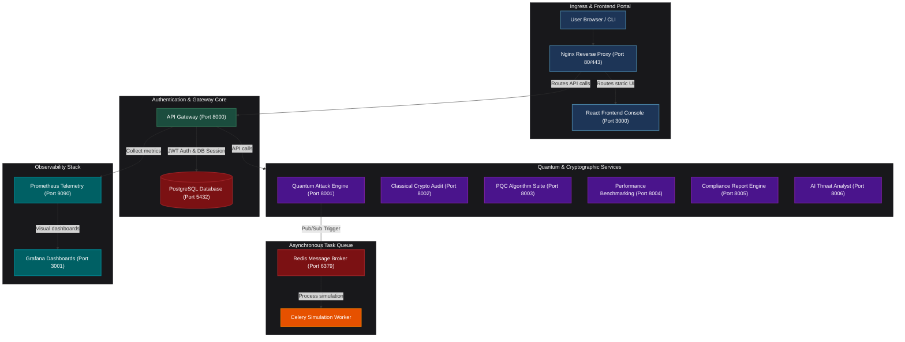

<p align="center">
  
</p>

<h1 align="center">Lattix - Q</h1>
<p align="center"><b>Enterprise Post-Quantum Cryptography (PQC) Migration & Risk Assessment Platform</b></p>

<p align="center">
  An advanced, premium cybersecurity dashboard that inventories legacy cryptographic assets, simulates Shor's and Grover's quantum attacks, profiles post-quantum lattice-based algorithms, and automates PQC transition auditing.
</p>

<p align="center">
  
  
  
  
  
  
  
</p>

<p align="center">
  <a href="#1-executive-summary">Executive Summary</a> •
  <a href="#4-architecture-overview">Architecture</a> •
  <a href="#7-quickstart">Quickstart</a> •
  <a href="#10-engineering-considerations">Engineering Considerations</a> •
  <a href="#13-references">References</a>
</p>

---

## Table of Contents

| | |
| :--- | :--- |
| 1. [Executive Summary](#1-executive-summary) | 9. [Design Decisions](#9-design-decisions) |
| 2. [Scope & Background](#2-scope--background) | 10. [Engineering Considerations](#10-engineering-considerations) |
| 3. [Key Capabilities](#3-key-capabilities) | 11. [Future Improvements](#11-future-improvements) |
| 4. [Architecture Overview](#4-architecture-overview) | 12. [Contributing](#12-contributing) |
| 5. [Tech Stack](#5-tech-stack) | 13. [References](#13-references) |
| 6. [Repository Structure](#6-repository-structure) | 14. [Show Your Support](#14-show-your-support) |
| 7. [Quickstart](#7-quickstart) | 15. [Author & Contact](#15-author--contact) |
| 8. [Troubleshooting](#8-troubleshooting) | |

---

## 1. Executive Summary

Lattix-Q is a unified cybersecurity risk-management platform designed to assist enterprises in auditing legacy public-key infrastructures (RSA, ECC) and orchestrating transitions to post-quantum standards. The platform models real-time computational overhead, analyzes application source code for vulnerable parameters, and generates cryptographic health reports ready for compliance audits.

---

## 2. Scope & Background

### The Threat: Store Now, Decrypt Later (SNDL)
Modern secure data communications rely heavily on public-key cryptography (like **RSA** and **ECC**). However, quantum computers utilizing **Shor's Algorithm** will be capable of breaking these mathematical problems in the future. Adversaries are actively harvesting encrypted enterprise data today (**SNDL**) to decrypt it once cryptographically relevant quantum computers (CRQCs) emerge.

### The Mandate: Transition to Post-Quantum Cryptography (PQC)
Enterprises must transition immediately to lattice-based cryptographic algorithms. Government directives such as **NIST SP 800-219** and the **NSA Commercial National Security Algorithm Suite (CNSA 2.0)** mandate complete migration to post-quantum standards (ML-KEM, ML-DSA) by 2030-2033.

---

## 3. Key Capabilities

| Quantum Attack Lab | AI Code Scanner | Crypto Workbench | Compliance & Reports |
| :--- | :--- | :--- | :--- |
| Simulate factorization and key-recovery using Shor's and Grover's algorithms. | Scan source code repositories to locate legacy cipher suites and auto-apply patches. | Run real-time performance benchmarks comparing ciphers under simulated network loads. | Generate professional PDF reports scoring transition maturity against NIST mandates. |

* **Quantum Attack Laboratory**: Estimating logical qubits required to crack ciphers dynamically.
* **AI Code Scanner**: Parse source files to identify cryptographic configurations and recommend secure updates.
* **PQC Benchmark Center**: Metric charts displaying execution times and key/ciphertext payload sizes.
* **Compliance Blueprints**: Interactive checklist scoring readiness for CNSA 2.0 timelines.

---

## 4. Architecture Overview

Lattix-Q uses a decoupled, containerized microservices mesh orchestrated via `docker-compose` and routed through an **Nginx reverse proxy** acting as a unified API Gateway.



---

## 5. Tech Stack

* **Frontend**: React 18, TypeScript 5, Vite 5, Tailwind CSS 3, Recharts, Lucide React
* **Backend Framework**: Python 3.11, FastAPI, Celery, Uvicorn
* **Quantum Modeling**: Qiskit 1.x (for period-finding algorithms)
* **Cryptographic Libs**: `liboqs` (Integration for Kyber/Dilithium), PyCryptodome
* **Databases & Cache**: PostgreSQL 15, Redis 7 (Broker & Result backend)
* **Infrastructure**: Docker Compose, Nginx, Prometheus, Grafana

---

## 6. Repository Structure

```
Lattix-Q/
├── assets/                  # Branding images and generated logos
├── docker/                  # Nginx proxy routing files
│   └── nginx/
│       └── default.conf
├── frontend/                # React (TypeScript + Vite) Application
│   ├── src/
│   │   ├── components/      # Common shell components
│   │   ├── pages/           # Core layout modules (Dashboard, Scanner)
│   │   └── index.css        # Global CSS rules
│   └── package.json
├── services/                # Containerized microservices
│   ├── ai-analyst-service/  # LLM context assistant
│   ├── api-gateway/         # Unified ingress validator
│   ├── benchmark-service/   # Encrypt/Decrypt profiling
│   ├── classical-crypto/    # Legacy auditing ciphers
│   ├── pqc-service/         # Liboqs implementations
│   ├── quantum-attack/      # Qiskit simulator engine
│   └── report-service/      # Audit scoring builder
├── docker-compose.yml       # Production orchestrator
└── README.md
```

---

## 7. Quickstart

### Prerequisites
Make sure your system has the following installed:
* [Docker Desktop](https://www.docker.com/products/docker-desktop/) (v20.10+)
* [Docker Compose](https://docs.docker.com/compose/) (v2.0+)
* [Git](https://git-scm.com/)

### Running the Localhost Environment

1. **Clone the Repository**:
   ```bash
   git clone https://github.com/shlok926/Lattix-Q.git
   cd Lattix-Q
   ```

2. **Initialize Environment Variables**:
   ```bash
   cp .env.example .env
   ```
   *Supply API keys (e.g. Anthropic key for the AI Threat Analyst) inside `.env` if desired.*

3. **Build and Spin Up the Containers**:
   ```bash
   docker-compose up -d --build
   ```

4. **Access the Interfaces**:
   * **Web Console Dashboard**: [http://localhost](http://localhost) (or port 3000)
   * **API Swagger Documentation**: [http://localhost:8000/docs](http://localhost:8000/docs)
   * **Grafana Monitoring Dashboard**: [http://localhost:3001](http://localhost:3001)

---

## 8. Troubleshooting

### Port Conflicts
If you receive port conflict errors (e.g. port `80` or `3000` is already in use by another app):
1. Open `docker-compose.yml` in your editor.
2. Edit the external port mappings under the `nginx` or `frontend` blocks (e.g. change `"80:80"` to `"8080:80"`).
3. Re-run `docker-compose up -d`.

### Docker Daemon Not Running
If you see `error during connect: daemon not response`, make sure **Docker Desktop** is open and running on your taskbar before launching commands.

---

## 9. Design Decisions

* **Microservices Partitioning**: Separating cryptographic calculations from core page state ensures that a heavy period-finding simulation doesn't degrade client UI responsiveness.
* **Celery Async Workers**: Shor's and Grover's algorithms are computationally heavy; offloading them to Celery ensures the API Gateway does not timeout waiting for results.
* **Client-Side Cron Backfilling**: Built-in background logic computes daily cron offsets during offline presentations to maintain data integrity in the scan list.

---

## 10. Engineering Considerations

* **Quantum Simulation Restrictions**: Standard server CPUs struggle to execute Shor's algorithm for keys above 16 bits. Lattix-Q uses mathematical scaling regressions to calculate physical/logical qubit requirements for keys of standard length (e.g. RSA-2048) rather than running real simulations.
* **Cryptographic Agility**: Key encapsulation (KEM) ciphers are bound to standard wrapper interfaces so that transition targets can adapt when NIST releases future FIPS amendments.

---

## 11. Future Improvements

* **Identity Provider Integration**: Migration of local user state databases to SAML 2.0 / OpenID Connect (OIDC) via Okta or Active Directory.
* **CI/CD Integration**: Creating a headless CLI scanner wrapper to automate vulnerability checks during push pipelines.
* **Hardware Security Modules (HSM)**: Enabling backend integrations to test PQC performance on local virtual HSM instances.

---

## 12. Contributing

Contributions, suggestions, and feedback are highly welcome!

* **Got suggestions or feature requests?** Feel free to open a new Issue or share your ideas.
* **Want to contribute?** Feel free to fork this repository, make your changes, and submit a Pull Request.

---

## 13. References

* **NIST FIPS 203 (ML-KEM)**: [Standard for Key-Encapsulation Mechanism](https://csrc.nist.gov/pubs/fips/203/ipd)
* **NIST FIPS 204 (ML-DSA)**: [Standard for Digital Signature Algorithm](https://csrc.nist.gov/pubs/fips/204/ipd)
* **NSA CNSA 2.0 Timelines**: [Commercial National Security Algorithm Suite 2.0 Transition Plan](https://www.nsa.gov/Cybersecurity/Post-Quantum-Cybersecurity-Resources/)

---

## Show Your Support

Love Lattix-Q? Help us grow:
* Star the repository (GitHub Star Button)
* Report bugs (GitHub Issues)
* Suggest features (GitHub Discussions)
* Share with others (LinkedIn/Twitter)
* Contribute code (Pull Requests)

---

## Author & Contact

<p align="center">
  <b>Shlok Thorat</b><br />
  <i>Let's connect on LinkedIn, collaborate, and build amazing things together!</i>
</p>

<p align="center">
  <a href="mailto:shlokthorat29075@gmail.com"></a>
  <a href="https://github.com/shlok926"></a>
  <a href="https://linkedin.com/in/shlok-thorat-39916a405"></a>
</p>

<p align="center">
  Made with 💖 by Shlok! for Cybersecurity Innovation • <a href="#lattix---q">Back to Top</a>
</p>
