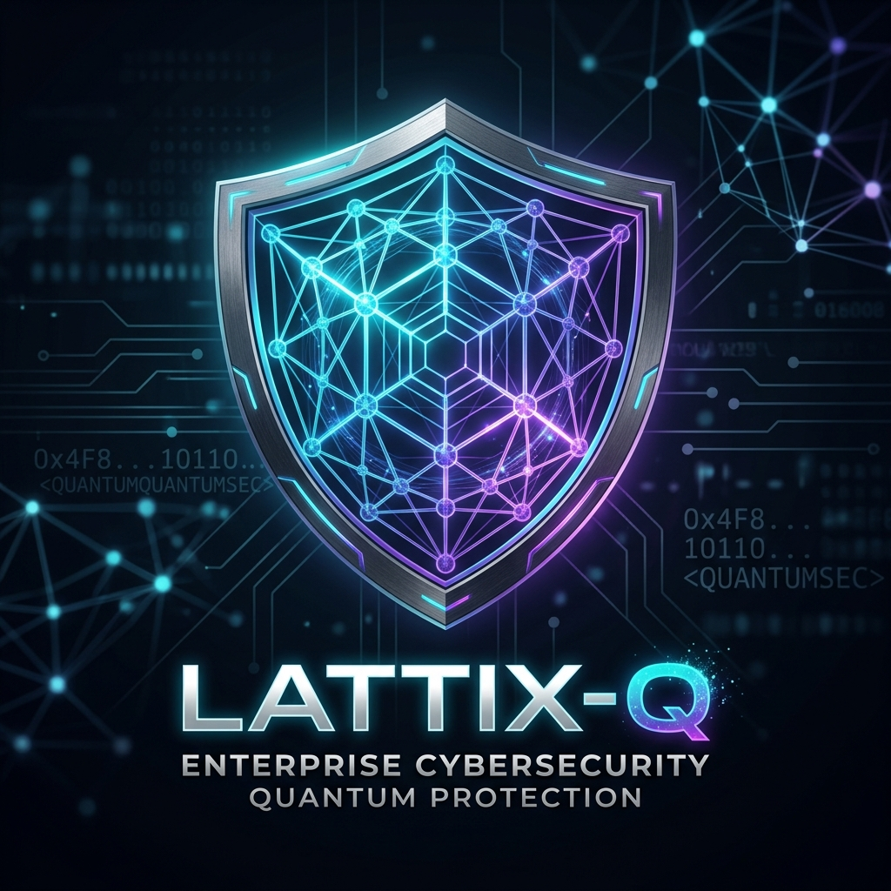
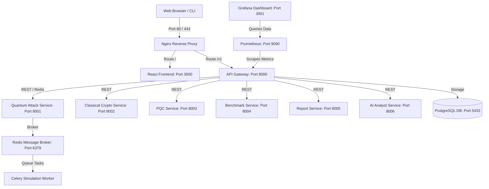

<p align="center">
  
</p>

<h1 align="center">Lattix - Q</h1>
<p align="center"><b>Enterprise Post-Quantum Cryptography (PQC) Migration & Risk Assessment Platform</b></p>

<p align="center">
  An advanced, premium cybersecurity dashboard that inventories legacy cryptographic assets, simulates Shor's and Grover's quantum attacks, profiles post-quantum lattice-based algorithms, and automates PQC transition auditing.
</p>

<p align="center">
  
  
  
  
  
  
  
</p>

<p align="center">
  <a href="#🚀-key-features-at-a-glance">Key Features</a> •
  <a href="#📊-project-overview--problem-statement">Overview & Context</a> •
  <a href="#🏗️-microservices-architecture">Architecture</a> •
  <a href="#🛡️-supported-algorithms">Supported PQC Algorithms</a> •
  <a href="#⚙️-quick-start">Quick Start</a> •
  <a href="#🔧-troubleshooting">Troubleshooting</a>
</p>

---

## 🚀 Key Features at a Glance

| ⚡ Quantum Attack Lab | 🔍 AI Code Scanner | 🧪 Crypto Workbench | 📋 Compliance & Reports |
| :--- | :--- | :--- | :--- |
| Simulate factorization and key-recovery using Shor's and Grover's algorithms. | Scan source code repositories to locate legacy cipher suites and auto-apply patches. | Run real-time performance benchmarks comparing classical ciphers vs. PQC ciphers. | Generate professional PDF reports scoring transition maturity against NIST mandates. |

---

## 📋 Table of Contents

* [🚀 Key Features at a Glance](#-key-features-at-a-glance)
* [📊 Project Overview & Problem Statement](#-project-overview--problem-statement)
* [🏗️ Microservices Architecture](#️-microservices-architecture)
* [🛠️ Core Capabilities & Modules](#️-core-capabilities--modules)
* [🛡️ Supported Algorithms](#️-supported-algorithms)
* [⚙️ Quick Start](#️-quick-start)
* [🔧 Troubleshooting & Development](#-troubleshooting--development)
* [📄 License](#-license)

---

## 📊 Project Overview & Problem Statement

### The Threat: Store Now, Decrypt Later (SNDL)
Modern secure data communications rely heavily on public-key cryptography (like **RSA** and **ECC**). However, quantum computers utilizing **Shor's Algorithm** will be capable of breaking these mathematical problems in the future. Adversaries are actively harvesting encrypted enterprise data today (**SNDL**) to decrypt it once cryptographically relevant quantum computers (CRQCs) emerge.

### The Mandate: Transition to Post-Quantum Cryptography (PQC)
Enterprises must transition immediately to lattice-based cryptographic algorithms. Government directives such as **NIST SP 800-219** and the **NSA Commercial National Security Algorithm Suite (CNSA 2.0)** mandate complete migration to post-quantum standards (ML-KEM, ML-DSA) by 2030-2033.

**Lattix-Q** solves this challenge by providing a centralized dashboard to:
1. **Assess risk**: Pinpoint legacy ciphers (RSA, ECC, 3DES) inside enterprise codebases.
2. **Profile algorithms**: Profile CPU/Memory metrics of new NIST-approved ciphers under different network loads.
3. **Simulate attacks**: Track simulated qubit scaling and attack complexities.

---

## 🏗️ Microservices Architecture

Lattix-Q uses a decoupled, containerized microservices mesh orchestrated via `docker-compose` and routed through an **Nginx reverse proxy** acting as a unified API Gateway.



---

## 🛠️ Core Capabilities & Modules

### 1. Quantum Attack Laboratory
* **Mathematical Emulation**: Emulate quantum period-finding (Shor's) and unstructured search (Grover's) algorithms.
* **Qubit Resource Estimation**: Calculate required physical and logical qubits needed to break ciphers based on key lengths.
* **IBM Quantum Cloud Integration**: Connect directly to Qiskit Runtime to run emulations on real hardware or Aer simulators.

### 2. AI Code Scanner (Batch Auditor)
* **Static AST Analysis**: Scan code files for hardcoded vulnerable ciphers (e.g. `MD5`, `SHA-1`, `RSA-1024`).
* **Auto-Patching Engine**: Propose secure replacements to modern standards (e.g., swapping RSA key exchange for Kyber KEM).
* **Scan History**: Retain complete cron audit logs of scheduled scans for compliance validation.

### 3. PQC Benchmark Center
* **Timing Profiling**: Profile execution speeds of key generation, encapsulation/signing, and decapsulation/verification.
* **Memory Footprint Assessment**: Compare ciphers under simulated network constraints to observe latency impacts.

---

## 🛡️ Supported Algorithms

Lattix-Q supports testing, benchmarking, and scanning configurations for the following cryptographic algorithms:

| Category | Algorithm | Standard / Specification | Security Strength |
| :--- | :--- | :--- | :--- |
| **PQC Key Encapsulation (KEM)** | **Kyber (ML-KEM)** | NIST FIPS 203 | NIST Levels 1, 3, 5 |
| **PQC Digital Signature** | **Dilithium (ML-DSA)** | NIST FIPS 204 | NIST Levels 2, 3, 5 |
| **PQC Digital Signature** | **Falcon** | NIST FIPS 205 | NIST Level 1 |
| **Classical Asymmetric** | **RSA** | PKCS #1 v2.2 | Vulnerable to Shor's |
| **Classical Asymmetric** | **ECC (ECDSA / ECDH)** | SECG SEC 2 | Vulnerable to Shor's |
| **Symmetric Cipher** | **AES** | FIPS 197 | AES-256 is Quantum-Safe (Grover-resistant) |

---

## ⚙️ Quick Start

### 📋 Prerequisites
Make sure your system has the following installed:
* [Docker Desktop](https://www.docker.com/products/docker-desktop/) (v20.10+)
* [Docker Compose](https://docs.docker.com/compose/) (v2.0+)
* [Git](https://git-scm.com/)

### 🚀 Running the Localhost Environment

1. **Clone the Repository**:
   ```bash
   git clone https://github.com/shlok926/Lattix-Q.git
   cd Lattix-Q
   ```

2. **Initialize Environment Variables**:
   ```bash
   cp .env.example .env
   ```
   *Edit `.env` to supply API keys (like Anthropic/OpenAI keys for the AI Analyst) if desired.*

3. **Build and Spin Up the Containers**:
   ```bash
   docker-compose up -d --build
   ```

4. **Access the Interfaces**:
   * **Web Console Dashboard**: [http://localhost](http://localhost) (or port 3000)
   * **API Swagger Documentation**: [http://localhost:8000/docs](http://localhost:8000/docs)
   * **Grafana Monitoring Dashboard**: [http://localhost:3001](http://localhost:3001)

---

## 🔧 Troubleshooting

### Port Conflicts
If you receive port conflict errors (e.g. port `80` or `3000` is already in use by another app):
1. Open `docker-compose.yml` in your editor.
2. Edit the external port mappings under the `nginx` or `frontend` blocks (e.g. change `"80:80"` to `"8080:80"`).
3. Re-run `docker-compose up -d`.

### Docker Daemon Not Running
If you see `error during connect: daemon not response`, make sure **Docker Desktop** is open and running on your taskbar before launching commands.

---

## 📄 License

This project is licensed under the MIT License. See the [LICENSE](LICENSE) file for details.
